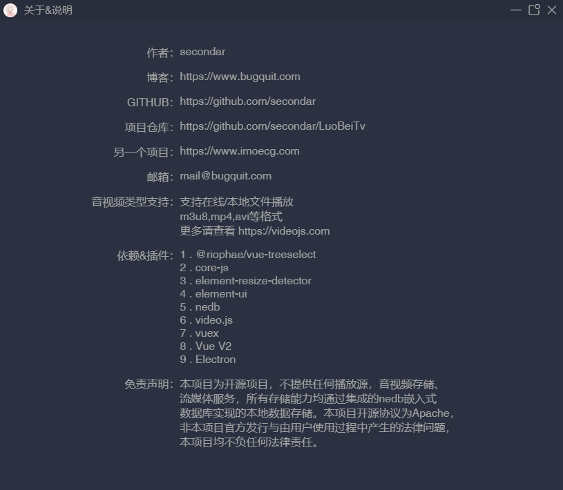

## 特性
基于Electron开发,很好的跨平台,除了这个好像也没啥特性了

## 依赖
```
1 . @riophae/vue-treeselect
2 . core-js
3 . element-resize-detector
4 . element-ui
5 . nedb
6 . video.js
7 . vuex
8 . Vue V2
9 . Electron
```

### 安装

```
git clone https://github.com/secondar/LuoBeiTv.git

cd LuoBeiTv

npm install

npm run dev:desktop

```

## 使用方法

添加播放源即可

推荐一个播放源仓库:https://github.com/SPX372928/MyIPTV

## 一些图片




## 免责声明

本项目为开源项目，不提供任何播放源，音视频存储、流媒体服务，所有存储能力均通过集成的nedb嵌入式,数据库实现的本地数据存储。

本项目开源协议为Apache，非本项目官方发行与由用户使用过程中产生的法律问题，本项目均不负任何法律责任。

## 开源协议

Apache